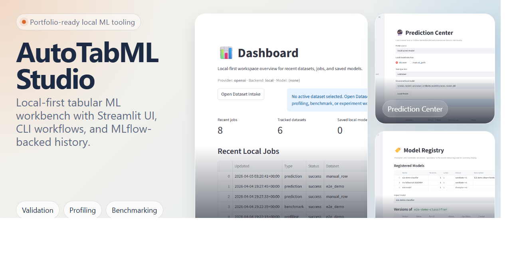
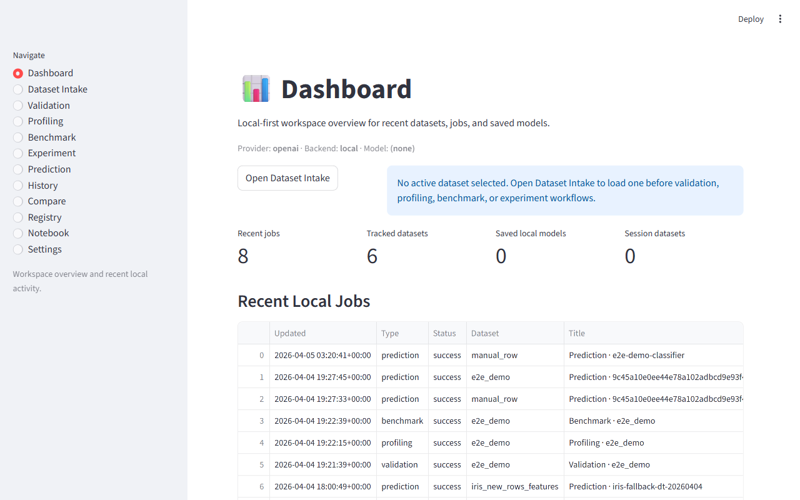
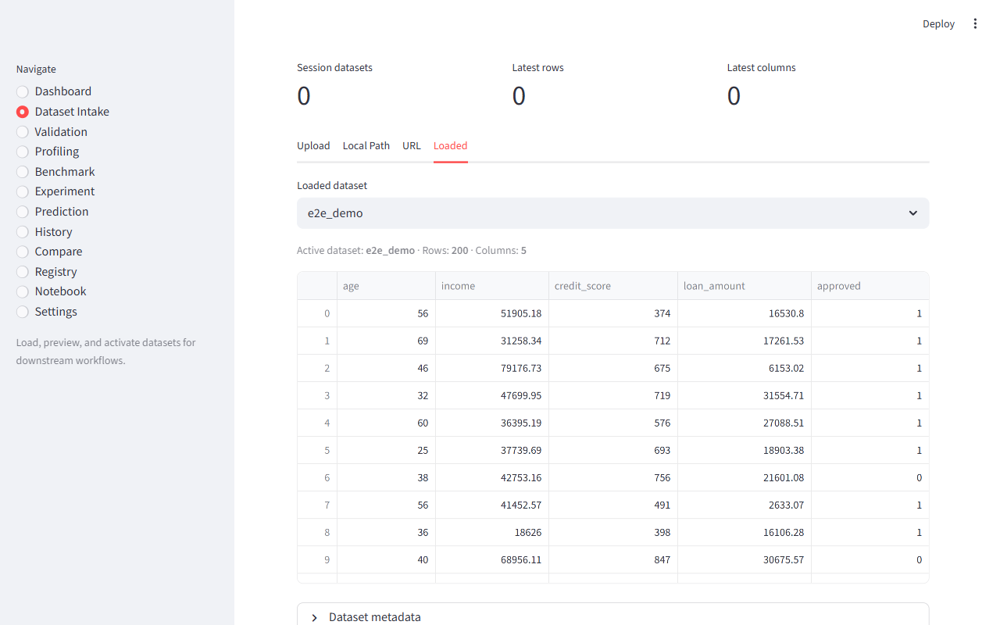
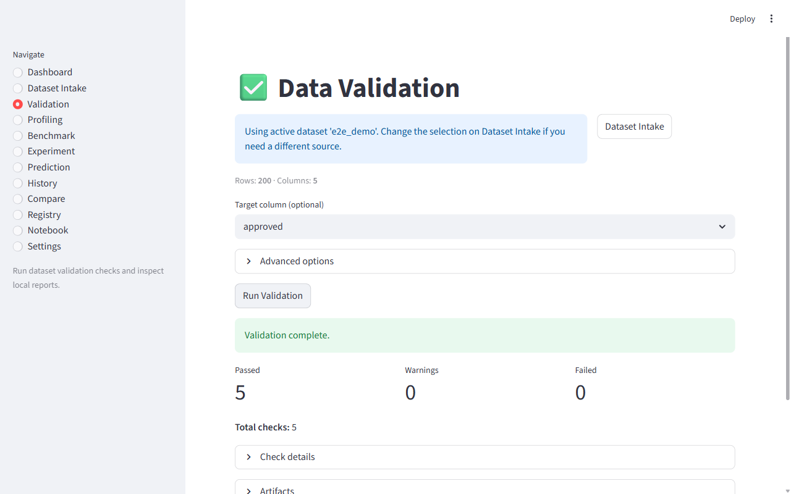
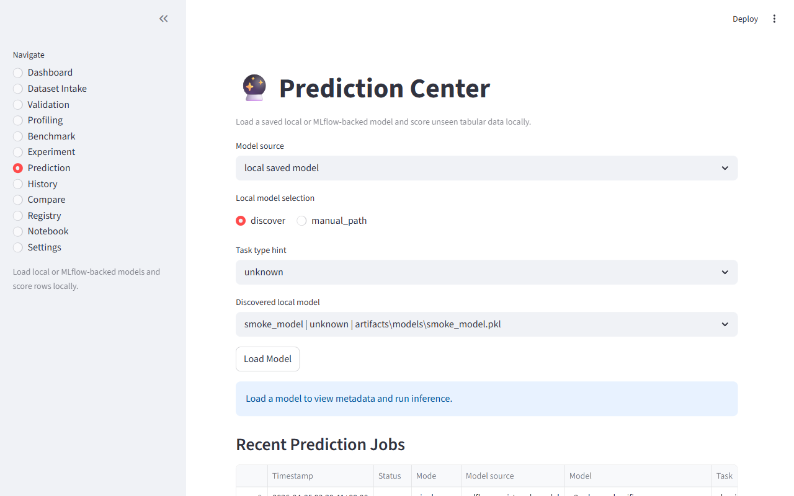
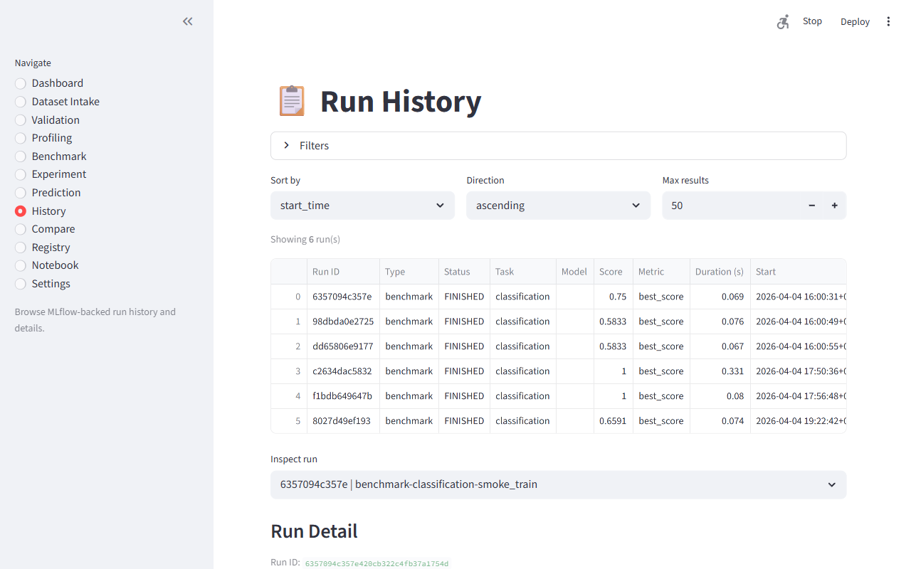
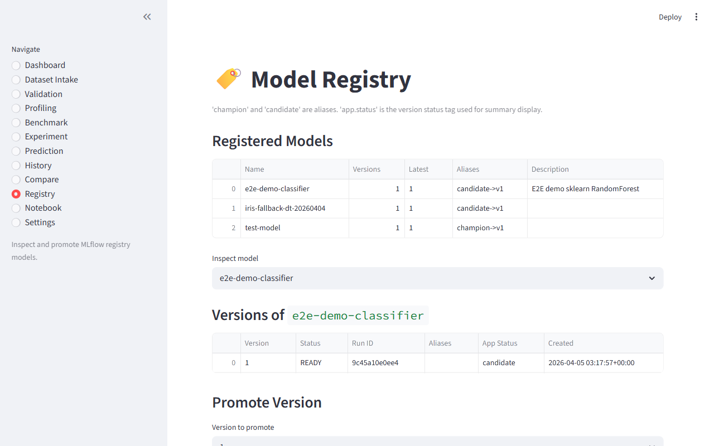

# AutoTabML Studio

<p align="center">
	
</p>

<p align="center">
	<strong>Local-first tabular ML workbench for dataset intake, validation, profiling, baseline benchmarking, PyCaret experiments, MLflow tracking, and local prediction.</strong>
</p>

<p align="center">
	Built for the messy middle of practical machine learning: the part between "I have a dataset" and "I have a model I can trust, compare, save, and score locally."
</p>

<p align="center">
	<a href="LICENSE"></a>
	
	
	
	
</p>

<p align="center">
	
	
	
	
	
	
	
</p>

<p align="center">
	<a href="#-what-you-get">What you get</a> •
	<a href="#-workflow">Workflow</a> •
	<a href="#-screens">Screens</a> •
	<a href="#-tech-stack">Tech stack</a> •
	<a href="#-quickstart">Quickstart</a> •
	<a href="#-documentation">Documentation</a>
</p>

## ✨ What You Get

AutoTabML Studio brings tabular ML workflows into one local-first workspace instead of scattering them across notebooks, scripts, ad hoc experiment folders, and standalone MLflow utilities.

### Core value

- One repo, two product surfaces: a Streamlit workspace for interactive use and a CLI for repeatable runs.
- Shared service-layer architecture so the UI and CLI use the same ingestion, validation, profiling, benchmarking, experiment, prediction, and tracking modules.
- Local-first artifact flow under `artifacts/` with SQLite-backed workspace metadata and MLflow-backed run history.
- Honest product boundaries: this is a practical experimentation workbench, not a deployment platform or remote orchestration system.

### Implemented today

- Dataset intake from local files, URLs, HTML tables, pandas DataFrames, optional Kaggle inputs, and the UCI ML Repository.
- Data validation with app-native checks and optional Great Expectations-backed validation.
- Profiling with optional `ydata-profiling`, large-dataset safeguards, and artifact output.
- Baseline model benchmarking with LazyPredict for classification and regression.
- PyCaret experiment workflows for compare, tune, evaluate, finalize, save, and save-all candidate models.
- Prediction flows for saved local models and MLflow-backed model references.
- MLflow-backed run history, run comparison, and model registry workflows.
- Local SQLite metadata for datasets, jobs, and saved local model records.

### Deliberately not claimed

- Production serving or deployment endpoints.
- Background job orchestration or worker infrastructure.
- Full notebook execution.
- Production-ready remote execution through `colab_mcp`.
- Monitoring, drift detection, fairness reporting, or observability pipelines.

## 🧭 Workflow

```text
Ingest -> Validate -> Profile -> Benchmark -> Experiment -> Save -> Predict -> Compare -> Register
```

### Typical operator flow

- Load a dataset from the Dataset Intake page or the CLI.
- Validate structural quality and target readiness.
- Generate profiling artifacts to inspect missingness, schema shape, and EDA summaries.
- Run baseline model benchmarks to quickly rank candidate estimators.
- Move promising candidates into PyCaret experiments for deeper iteration.
- Finalize and save one model or save all compared models locally.
- Score single rows or batches through the Prediction Center.
- Review MLflow history, compare prior runs, and optionally register or promote models.

See [docs/user-flow.md](docs/user-flow.md) for the end-to-end product flow.

## 🖼️ Screens

<table>
	<tr>
		<td width="50%">
			
			<br>
			<strong>Dashboard</strong>
			<br>
			Workspace status, recent jobs, tracked datasets, and saved models.
		</td>
		<td width="50%">
			
			<br>
			<strong>Dataset Intake</strong>
			<br>
			Load local files, URLs, HTML tables, UCI datasets, and session-ready DataFrames.
		</td>
	</tr>
	<tr>
		<td width="50%">
			
			<br>
			<strong>Validation</strong>
			<br>
			Target-aware validation summaries and artifact generation.
		</td>
		<td width="50%">
			
			<br>
			<strong>Prediction Center</strong>
			<br>
			Discover saved models, validate schema compatibility, and score rows or files.
		</td>
	</tr>
	<tr>
		<td width="50%">
			
			<br>
			<strong>History</strong>
			<br>
			Inspect MLflow-backed run history for benchmarks and experiments.
		</td>
		<td width="50%">
			
			<br>
			<strong>Registry</strong>
			<br>
			Review registered models and promote versions with alias-driven semantics.
		</td>
	</tr>
</table>

Additional capture notes live in [docs/assets/screenshots/README.md](docs/assets/screenshots/README.md).

## 🧱 Tech Stack

| Layer | Stack |
| --- | --- |
| UI | Streamlit |
| CLI | `argparse`-based `autotabml` command |
| Core data model | pandas, pydantic, pydantic-settings |
| Ingestion | local files, URLs, HTML tables, `ucimlrepo`, optional Kaggle |
| Validation | app-native validation rules, optional Great Expectations |
| Profiling | `ydata-profiling` with sampling and large-dataset guards |
| Benchmarking | LazyPredict, scikit-learn, optional XGBoost, LightGBM, CatBoost |
| Experimentation | PyCaret |
| Tracking | MLflow |
| Workspace metadata | SQLite |
| Testing | pytest, pytest-cov, pytest-asyncio, respx |

### Supported task types

- Classification
- Regression

### Execution surfaces

| Surface | Purpose |
| --- | --- |
| Streamlit app | Primary interactive workspace for operators and demos |
| CLI | Repeatable workflows, diagnostics, history queries, and automation-friendly operations |

### Supported input types

- Local CSV, TSV, delimiter-based text, and Excel files.
- URL-based CSV, TSV, delimiter-based text, and Excel files.
- HTML pages with real table markup.
- In-memory pandas DataFrames.
- UCI ML Repository datasets via `ucimlrepo`.
- Optional Kaggle dataset loading with explicit file selection.

## 🏗️ Architecture At A Glance

The repo is intentionally split so Streamlit pages stay thin and the service layer owns business logic.

| Module | Responsibility |
| --- | --- |
| `app/ingestion/` | source routing, loaders, normalization, metadata hashing |
| `app/validation/` | rules, optional GX checks, validation artifacts |
| `app/profiling/` | profiling orchestration, selectors, summaries, artifacts |
| `app/modeling/benchmark/` | baseline benchmark orchestration, ranking, MLflow logging |
| `app/modeling/pycaret/` | compare, tune, evaluate, finalize, save, snapshot workflows |
| `app/prediction/` | model discovery, loading, schema checks, scoring, prediction artifacts |
| `app/tracking/` | MLflow queries, history inspection, run comparison |
| `app/registry/` | MLflow model registration and promotion |
| `app/storage/` | SQLite metadata store for local workspace activity |
| `app/artifacts/` | canonical artifact path management |
| `app/pages/` | Streamlit page entrypoints only |
| `app/cli.py` | CLI entrypoint and command wiring |

### Storage model

- MLflow is the source of truth for benchmark runs, experiment runs, comparison inputs, and registry state.
- SQLite stores local workspace metadata only: loaded datasets, local jobs, and saved local-model records.
- Artifacts are written locally under `artifacts/` through a centralized artifact manager.

For more detail, see [docs/architecture.md](docs/architecture.md) and [docs/developer-guide.md](docs/developer-guide.md).

## ⚙️ Quickstart

### Python version guidance

Python 3.10 through 3.13 is supported for the base project. Use Python 3.11 or 3.12 when you want the full local workflow including PyCaret experiments. PyCaret is not currently validated on Python 3.13 in this environment.

### 1. Create and activate a virtual environment

```bash
python -m venv .venv
```

Windows PowerShell:

```powershell
.\.venv\Scripts\Activate.ps1
```

### 2. Install the project

Base install:

```bash
pip install -e ".[dev]"
```

Optional workflow packs:

| Install profile | Command | Use when |
| --- | --- | --- |
| Validation | `pip install -e ".[validation]"` | You want Great Expectations-backed validation |
| Profiling | `pip install -e ".[profiling]"` | You want `ydata-profiling` reports |
| Benchmarking | `pip install -e ".[benchmark]"` | You want LazyPredict, MLflow, and boosted model baselines |
| Experiments | `pip install -e ".[experiment]"` | You want PyCaret compare, tune, evaluate, and save flows |
| Kaggle | `pip install -e ".[kaggle]"` | You want optional Kaggle dataset ingestion |
| GPU add-on | `pip install -e ".[gpu]"` | You want GPU-capable boosting libraries without the full workflow stack |

Full maintainer or demo install:

```bash
pip install -e ".[dev,validation,profiling,benchmark,experiment,gpu,kaggle]"
```

Notes:

- The profiling extra currently needs `setuptools < 82`; that compatibility pin is already encoded in `pyproject.toml`.
- Benchmark and experiment stacks prefer CUDA when the installed libraries support it and fall back to CPU otherwise.

### 3. Initialize local storage and validate the runtime

```bash
autotabml init-local-storage
autotabml doctor
```

### 4. Launch the app

```bash
streamlit run app/main.py
```

After launch, start with Dataset Intake, load a dataset into session state, then drive validation, profiling, benchmarking, experiments, or prediction from the UI.

## 💻 CLI Examples

Top-level help:

```bash
autotabml --version
autotabml info
autotabml --help
```

Representative workflows:

```bash
autotabml validate data/train.csv --target price --artifacts-dir artifacts/validation
autotabml profile data/train.csv --artifacts-dir artifacts/profiling
autotabml benchmark data/train.csv --target target --task-type auto --artifacts-dir artifacts/benchmark
autotabml experiment-run data/train.csv --target target --task-type classification --n-select 3
autotabml predict-history --limit 10
autotabml history-list --run-type experiment --limit 10
autotabml registry-list
```

For a rehearsed product walkthrough, use [docs/demo-guide.md](docs/demo-guide.md).

## 🔐 Configuration

- Non-secret settings persist to `~/.autotabml/settings.json`.
- Provider API keys are expected from environment variables or session-only UI input.
- Secrets are not written to the persisted settings file.
- Startup logging redacts obvious secret-like substrings.
- Environment variable layout is documented in [.env.example](.env.example).

Example overrides:

```bash
AUTOTABML_WORKSPACE_MODE=dashboard
AUTOTABML_EXECUTION__BACKEND=local
AUTOTABML_MLFLOW__TRACKING_URI=sqlite:///artifacts/mlflow/mlflow.db
AUTOTABML_DATABASE__PATH=artifacts/app/app_metadata.sqlite3
AUTOTABML_OLLAMA_BASE_URL=http://localhost:11434
AUTOTABML_PROVIDER__BASE_URL=https://api.example.com/v1
```

Provider credentials remain unprefixed, for example:

```bash
OPENAI_API_KEY=...
ANTHROPIC_API_KEY=...
GEMINI_API_KEY=...
```

### Provider settings supported in the UI

- OpenAI
- Anthropic
- Gemini
- Ollama

## 🧪 Quality And Release Checks

Local test commands:

```bash
pytest
```

Coverage gate used in CI:

```bash
pytest tests/ --cov=app --cov-report=term --cov-fail-under=65
```

Optional integration suite:

```bash
pytest -m integration
```

### Automation in `.github/workflows/`

- CI runs unit tests on Python 3.11 and 3.13.
- A repo-wide coverage gate runs on every push and pull request.
- Security workflows run `detect-secrets` and `gitleaks`.
- Release-readiness checks validate build metadata and `twine` compatibility for tagged releases.

## ⚠️ Current Limitations

- Notebook mode exists as a workspace concept, but it is currently a placeholder rather than a full notebook runner.
- The `colab_mcp` backend is scaffolded only; real remote execution is not implemented.
- Optional dependencies must be installed explicitly for validation, profiling, benchmarking, MLflow, and PyCaret workflows.
- PyCaret-backed experiment, finalize/save, and local saved-model prediction flows are not currently validated on Python 3.13 in this environment.
- The project is local-first and does not implement deployment, serving, background job orchestration, or monitoring pipelines.
- Very large datasets may still require sampling because profiling and experiment flows operate on pandas DataFrames.

Detailed caveats live in [docs/limitations.md](docs/limitations.md).

## 📚 Documentation

- [docs/user-flow.md](docs/user-flow.md) for the end-to-end product flow.
- [docs/architecture.md](docs/architecture.md) for module boundaries and responsibilities.
- [docs/developer-guide.md](docs/developer-guide.md) for implementation notes and operational details.
- [docs/demo-guide.md](docs/demo-guide.md) for a concise demo script.
- [CHANGELOG.md](CHANGELOG.md) for release notes.
- [CONTRIBUTING.md](CONTRIBUTING.md) for local maintainer workflow guidance.
- [docs/repo-presentation.md](docs/repo-presentation.md) for public-facing repo presentation notes.

## 📄 License

AutoTabML Studio is licensed under the Apache License 2.0. See [LICENSE](LICENSE).
