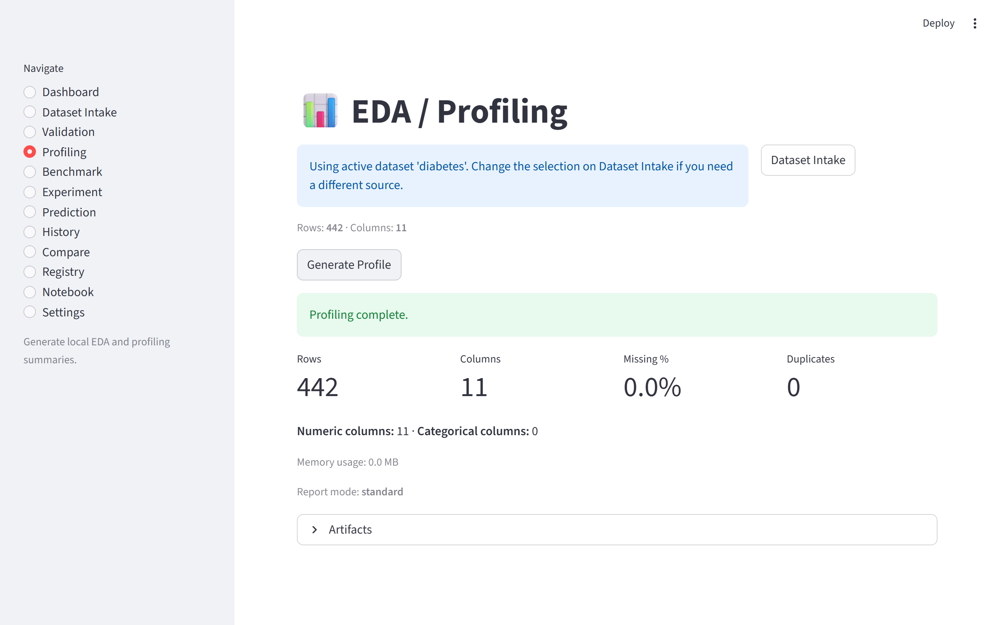
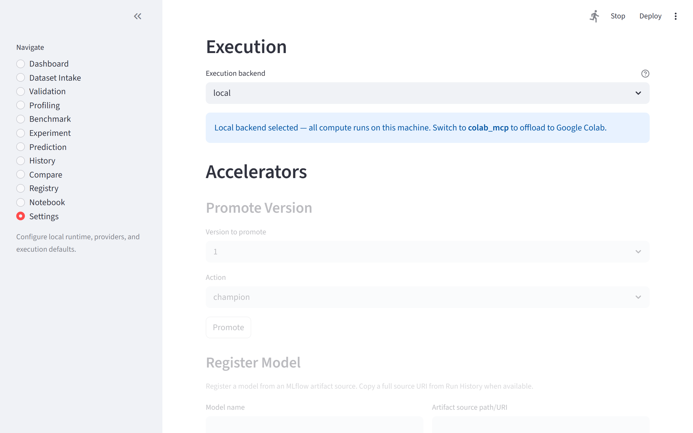

# AutoTabML Studio

<p align="center">
	
</p>

<p align="center">
	<strong>Local-first automated machine learning workbench for tabular data — from raw dataset to trained, evaluated, and deployable model.</strong>
</p>

<p align="center">
	Built for the practical middle of machine learning: the part between "I have a dataset" and "I have a model I can trust, compare, save, and score locally."
</p>

<p align="center">
	<a href="https://github.com/pypi-ahmad/AutoTabML-Studio/actions/workflows/ci.yml"></a>
	<a href="https://github.com/pypi-ahmad/AutoTabML-Studio/actions/workflows/security.yml"></a>
	<a href="LICENSE"></a>
	
	
	
	
</p>

<p align="center">
	
	
	
	
	
	
	
</p>

<p align="center">
	<a href="#-what-you-get">What you get</a> •
	<a href="#-workflow">Workflow</a> •
	<a href="#-screens">Screens</a> •
	<a href="#-tech-stack">Tech stack</a> •
	<a href="#-quickstart">Quickstart</a> •
	<a href="#-usage-guide">Usage guide</a> •
	<a href="#-cli-examples">CLI</a> •
	<a href="#-documentation">Documentation</a>
</p>

## ✨ What You Get

AutoTabML Studio brings tabular ML workflows into one local-first workspace instead of scattering them across notebooks, scripts, ad hoc experiment folders, and standalone tracking utilities.

### Core design

- **Two surfaces, one service layer.** A Streamlit UI for interactive use and a CLI for repeatable/scripted runs, backed by the same ingestion, validation, profiling, benchmarking, experiment, prediction, and tracking modules.
- **Local-first storage.** All artifacts live under `artifacts/`, workspace metadata in SQLite, run history in MLflow.
- **Privacy by default.** Your data stays on your machine. No telemetry, no external uploads.
- **Guided workflow.** A five-step guided path from data loading to predictions, with optional validation and profiling steps.

### Features

- **Data loading** from local files (CSV, Excel, TSV, TXT), URLs, HTML tables, and the UCI ML Repository.
- **Data validation** with app-native quality checks and optional Great Expectations integration.
- **Data profiling** with optional ydata-profiling (EDA reports, large-dataset safeguards, sampling).
- **Quick benchmarking** with LazyPredict to screen dozens of classification and regression algorithms.
- **Model training** with PyCaret — compare, tune, evaluate, and save production-ready models.
- **Predictions** — batch scoring and single-row prediction with form-based or JSON input.
- **Model testing** — evaluate models against held-out data with ground-truth labels.
- **Run history, comparison, and model registry** backed by MLflow.
- **Auto-generated notebooks** for every workflow run, downloadable or openable in Google Colab.
- **AI-generated run summaries** via OpenAI, Anthropic, Gemini, or local Ollama.

### Scope boundaries

This is a local experimentation workbench. It does not provide:

- Production model serving or deployment endpoints
- Background job orchestration or worker infrastructure
- Monitoring, drift detection, or observability pipelines
- Full notebook execution (auto-generated notebooks are for export only)

## 🧭 Workflow

```text
Ingest -> Validate -> Profile -> Benchmark -> Experiment -> Save -> Predict -> Compare -> Register
```

### Typical flow

1. **Load Data** — upload a file, paste a URL, or pick a UCI dataset.
2. **Validate** *(optional)* — check for missing values, schema issues, and data leakage.
3. **Profile** *(optional)* — generate a visual EDA summary.
4. **Quick Benchmark** — screen dozens of algorithms and get a ranked leaderboard.
5. **Train & Tune** — fine-tune the best algorithm, evaluate with charts, and save a production model.
6. **Predict** — score new data (single row or batch file) with your saved model.
7. **Compare & Register** — review run history, compare algorithms, and promote models.

See [docs/user-flow.md](docs/user-flow.md) for the detailed product flow and [USAGE.md](USAGE.md) for the full usage guide.

## 🖼️ Screens

<table>
	<tr>
		<td width="50%">
			
			<br>
			<strong>Dashboard</strong>
			<br>
			Workflow progress, recommended next steps, and recent activity.
		</td>
		<td width="50%">
			
			<br>
			<strong>Load Data</strong>
			<br>
			Upload files, paste URLs, or load datasets from the UCI repository.
		</td>
	</tr>
	<tr>
		<td width="50%">
			
			<br>
			<strong>Validation</strong>
			<br>
			Target-aware quality checks with pass/fail summaries.
		</td>
		<td width="50%">
			
			<br>
			<strong>Predictions</strong>
			<br>
			Select a saved model, upload data, and score individual rows or full files.
		</td>
	</tr>
	<tr>
		<td width="50%">
			
			<br>
			<strong>Profiling</strong>
			<br>
			Visual EDA reports with distributions, correlations, and missing-value analysis.
		</td>
		<td width="50%">
			
			<br>
			<strong>History</strong>
			<br>
			Browse and filter past runs across all workflow types.
		</td>
	</tr>
	<tr>
		<td width="50%">
			
			<br>
			<strong>Registry</strong>
			<br>
			Version, promote, and manage your best models (Champion / Candidate / Archived).
		</td>
		<td width="50%">
			
			<br>
			<strong>Settings</strong>
			<br>
			Essentials and Advanced tabs for workspace, GPU, provider, and tracking configuration.
		</td>
	</tr>
</table>

All screenshots above were captured from a real local Streamlit session. The repeatable capture script is [scripts/capture_screenshots.py](scripts/capture_screenshots.py).

## 🧱 Tech Stack

| Layer | Stack |
| --- | --- |
| UI | Streamlit (custom sidebar navigation, sectioned pages) |
| CLI | `argparse`-based `autotabml` command |
| Data | pandas, pydantic, pydantic-settings |
| Ingestion | Local files, URLs, HTML tables, `ucimlrepo`, optional Kaggle |
| Validation | App-native quality rules, optional Great Expectations |
| Profiling | `ydata-profiling` with sampling and large-dataset safeguards |
| Benchmarking | LazyPredict, scikit-learn, XGBoost, LightGBM, CatBoost |
| Training | PyCaret (compare, tune, evaluate, finalize, save) |
| Tracking | MLflow (local SQLite backend by default) |
| Metadata | SQLite |
| AI Summaries | OpenAI, Anthropic, Gemini, Ollama (all optional) |
| Testing | pytest, pytest-cov, pytest-asyncio, respx |

### Supported task types

- Classification
- Regression

### Execution surfaces

| Surface | Purpose |
| --- | --- |
| Streamlit app | Interactive workspace for data exploration, model training, and predictions |
| CLI | Repeatable workflows, diagnostics, history queries, and scripted automation |

### Supported input formats

| Format | Extensions |
| --- | --- |
| CSV | `.csv` |
| Delimited text | `.tsv`, `.txt`, `.data` |
| Excel | `.xlsx`, `.xls`, `.xlsm`, `.xlsb` |
| Web URL | HTTP/HTTPS links to data files |
| HTML tables | Pages with `<table>` markup |
| UCI ML Repository | Search by name or ID via `ucimlrepo` |
| Kaggle | Optional, CLI-only (`pip install -e ".[kaggle]"`) |

## 🏗️ Project Structure

Streamlit pages are thin entry points. Business logic lives in the service layer.

| Module | Responsibility |
| --- | --- |
| `app/ingestion/` | Source routing, loaders, normalization, metadata hashing |
| `app/validation/` | Quality rules, optional GX checks, validation artifacts |
| `app/profiling/` | Profiling orchestration, selectors, summaries, artifacts |
| `app/modeling/benchmark/` | Baseline benchmark orchestration, ranking, MLflow logging |
| `app/modeling/pycaret/` | Compare, tune, evaluate, finalize, save, snapshot workflows |
| `app/prediction/` | Model discovery, loading, schema checks, scoring |
| `app/tracking/` | MLflow queries, history inspection, run comparison |
| `app/registry/` | MLflow model registration and promotion |
| `app/storage/` | SQLite metadata store for workspace activity |
| `app/artifacts/` | Canonical artifact path management |
| `app/providers/` | LLM provider integrations (OpenAI, Anthropic, Gemini, Ollama) |
| `app/notebooks/` | Jupyter notebook generation for completed runs |
| `app/config/` | Pydantic settings, enums, environment variable binding |
| `app/pages/` | Streamlit page entry points and shared UI components |
| `app/cli.py` | CLI entry point and command wiring |

### Storage

- **MLflow** is the source of truth for benchmark runs, experiment runs, comparison data, and registry state.
- **SQLite** stores local workspace metadata: loaded datasets, job records, and saved model records.
- **`artifacts/`** holds all generated output: reports, models, predictions, and tracking databases.

For more detail, see [docs/architecture.md](docs/architecture.md) and [docs/developer-guide.md](docs/developer-guide.md).

## ⚙️ Quickstart

### Python version guidance

Python 3.10 through 3.13 is supported for the base project. Use Python 3.11 or 3.12 when you want the full local workflow including PyCaret experiments. PyCaret is not currently validated on Python 3.13 in this environment.

### 1. Create and activate a virtual environment

```bash
python -m venv .venv
```

Windows PowerShell:

```powershell
.\.venv\Scripts\Activate.ps1
```

### 2. Install the project

Base install:

```bash
pip install -e ".[dev]"
```

Optional workflow packs:

| Install profile | Command | Use when |
| --- | --- | --- |
| Validation | `pip install -e ".[validation]"` | You want Great Expectations-backed validation |
| Profiling | `pip install -e ".[profiling]"` | You want `ydata-profiling` reports |
| Benchmarking | `pip install -e ".[benchmark]"` | You want LazyPredict, MLflow, and boosted model baselines |
| Experiments | `pip install -e ".[experiment]"` | You want PyCaret compare, tune, evaluate, and save flows |
| Kaggle | `pip install -e ".[kaggle]"` | You want optional Kaggle dataset ingestion |
| GPU add-on | `pip install -e ".[gpu]"` | You want GPU-capable boosting libraries without the full workflow stack |

Full maintainer or demo install:

```bash
pip install -e ".[dev,validation,profiling,benchmark,experiment,gpu,kaggle]"
```

Notes:

- The profiling extra currently needs `setuptools < 82`; that compatibility pin is already encoded in `pyproject.toml`.
- Benchmark and experiment stacks prefer CUDA when the installed libraries support it and fall back to CPU otherwise.

### 3. Initialize local storage and validate the runtime

```bash
autotabml init-local-storage
autotabml doctor
```

### 4. Launch the app

```bash
streamlit run app/main.py
```

After launch, start with **Load Data**, then follow the guided workflow through validation, profiling, benchmarking, training, and prediction.

## � Usage Guide

For detailed, step-by-step instructions on every feature, see **[USAGE.md](USAGE.md)**.

| Section | What it covers |
| --- | --- |
| [Who This Is For](USAGE.md#who-this-is-for) | Target audience and use cases |
| [Before You Start](USAGE.md#before-you-start) | Prerequisites, install options, first-time setup |
| [Starting the App](USAGE.md#starting-the-app) | Streamlit UI and CLI entry points |
| [Core Workflow](USAGE.md#core-workflow) | The five-step guided path from data to predictions |
| [Pages Reference](USAGE.md#pages-reference) | Every page explained — Dashboard, Load Data, Validation, Profiling, Benchmark, Train & Tune, Predictions, Test & Evaluate, Models, History, Comparison, Registry, Notebooks, Settings |
| [CLI Reference](USAGE.md#cli-reference) | All commands: system, data prep, benchmark, experiment, predict, history, registry |
| [Configuration](USAGE.md#configuration) | Environment variables and optional dependency groups |
| [Input & Output](USAGE.md#input--output) | Supported file formats and the `artifacts/` directory layout |
| [Troubleshooting](USAGE.md#troubleshooting) | Common issues with causes and fixes |
| [Limitations](USAGE.md#limitations) | Known constraints and scope boundaries |

## �💻 CLI Examples

Top-level help:

```bash
autotabml --version
autotabml info
autotabml --help
```

Representative workflows:

```bash
autotabml validate data/train.csv --target price --artifacts-dir artifacts/validation
autotabml profile data/train.csv --artifacts-dir artifacts/profiling
autotabml benchmark data/train.csv --target target --task-type auto --artifacts-dir artifacts/benchmark
autotabml experiment-run data/train.csv --target target --task-type classification --n-select 3
autotabml predict-history --limit 10
autotabml history-list --run-type experiment --limit 10
autotabml registry-list
```

For a rehearsed product walkthrough, use [docs/demo-guide.md](docs/demo-guide.md).

## 🔐 Configuration

Settings are managed through three layers:

1. **Defaults** — Pydantic-defined defaults in `app/config/models.py`.
2. **Persisted settings** — Saved to `~/.autotabml/settings.json` (secrets are excluded).
3. **Environment overrides** — `AUTOTABML_*` prefixed variables (see [.env.example](.env.example)).

Example overrides:

```bash
AUTOTABML_WORKSPACE_MODE=dashboard
AUTOTABML_EXECUTION__BACKEND=local
AUTOTABML_MLFLOW__TRACKING_URI=sqlite:///artifacts/mlflow/mlflow.db
AUTOTABML_DATABASE__PATH=artifacts/app/app_metadata.sqlite3
AUTOTABML_OLLAMA_BASE_URL=http://localhost:11434
AUTOTABML_PROVIDER__BASE_URL=https://api.example.com/v1
```

Provider credentials remain unprefixed, for example:

```bash
OPENAI_API_KEY=...
ANTHROPIC_API_KEY=...
GEMINI_API_KEY=...
```

### LLM providers supported in Settings

| Provider | Key variable |
| --- | --- |
| OpenAI | `OPENAI_API_KEY` |
| Anthropic | `ANTHROPIC_API_KEY` |
| Gemini | `GEMINI_API_KEY` |
| Ollama | `AUTOTABML_OLLAMA_BASE_URL` (local, no API key) |

## 🧪 Testing

Unit tests:

```bash
pytest
```

Coverage gate used in CI:

```bash
pytest tests/ --cov=app --cov-report=term --cov-fail-under=65
```

Optional integration suite:

```bash
pytest -m integration
```

### CI / CD

| Workflow | What it does |
| --- | --- |
| **CI** ([ci.yml](.github/workflows/ci.yml)) | Lint (`ruff`), unit tests (Python 3.11 + 3.13), coverage gate (≥65%), E2E smoke test |
| **Security** ([security.yml](.github/workflows/security.yml)) | `detect-secrets` + `gitleaks` scanning on every push and PR |
| **Release readiness** ([release-readiness.yml](.github/workflows/release-readiness.yml)) | Build validation and `twine check` for tagged releases |

Dependabot is configured for weekly pip and GitHub Actions dependency updates.

## ⚠️ Limitations

- **PyCaret requires Python < 3.13.** All other features work on 3.10–3.13.
- **GPU training** requires NVIDIA hardware with CUDA drivers. Falls back to CPU automatically.
- **Large datasets** (100K+ rows) trigger automatic sampling in benchmark and profiling.
- **Kaggle integration** is CLI-only; not exposed in the Streamlit UI.
- **Local-first only.** No deployment endpoints, remote orchestration, or monitoring pipelines.
- **Single-user.** Designed for individual use on a local machine, not concurrent multi-user access.
- **AI summaries** require an API key (OpenAI/Anthropic/Gemini) or a local Ollama instance.

## 📚 Documentation

- [USAGE.md](USAGE.md) — Complete usage guide with step-by-step instructions for every feature.
- [docs/user-flow.md](docs/user-flow.md) — End-to-end product flow.
- [docs/architecture.md](docs/architecture.md) — Module boundaries and responsibilities.
- [docs/developer-guide.md](docs/developer-guide.md) — Implementation notes and development workflow.
- [docs/demo-guide.md](docs/demo-guide.md) — Concise demo walkthrough script.
- [CHANGELOG.md](CHANGELOG.md) — Release notes.
- [CONTRIBUTING.md](CONTRIBUTING.md) — Contribution guidelines.
- [SECURITY.md](SECURITY.md) — Security policy.

## 📄 License

AutoTabML Studio is licensed under the Apache License 2.0. See [LICENSE](LICENSE).
