<div align="center">

# AutoTabML Studio

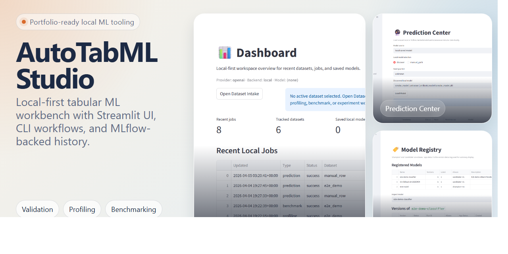

**Local-first automated machine learning workbench for tabular data.**

Go from a raw CSV to a trained, evaluated, and deployable model — entirely on
your machine. The same service layer powers the Streamlit UI and the CLI, so
results are always reproducible. No cloud account, no outbound telemetry.

**What it is.** A single workspace that wraps three common tabular AutoML
paths — LazyPredict, PyCaret, and FLAML — plus local Google TabFM research
evaluation and TimesFM 2.5 forecasting, with MLflow tracking, a local model
registry, and quality/profiling guard-rails.

<br>

[](https://github.com/pypi-ahmad/AutoTabML-Studio/actions/workflows/ci.yml)
[](https://github.com/pypi-ahmad/AutoTabML-Studio/actions/workflows/security.yml)
[](LICENSE)


[Features](#-features) · [Quick Start](#-quick-start) · [Screenshots](#-screenshots) · [Architecture](#-architecture) · [Observability](#-observability) · [Docs](#-documentation)

</div>

---

## Why AutoTabML Studio?

Most tabular ML work is scattered across notebooks, throwaway scripts, and manual model-file management. AutoTabML Studio consolidates the entire lifecycle into a single local workspace with a **Streamlit UI** and a **CLI** — backed by the same service layer so results are always reproducible.

- **Zero cloud dependency.** Data never leaves your machine. No default outbound telemetry or external uploads.
- **Three AutoML engines.** LazyPredict for quick benchmarks, PyCaret for full experiments, and Microsoft FLAML for fast, cost-efficient hyperparameter search.
- **Foundation models.** Research-only TabFM classification/regression and TimesFM 2.5 point/quantile forecasting, both revision-pinned and local.
- **End-to-end tracking.** When MLflow is installed, runs log aggregate metrics, parameters, and safe summary artifacts. Compare, version, and promote deployable models from one place.
- **729 unit tests** with a CI-enforced ≥ 65% coverage gate and `ruff` lint on every push. `detect-secrets` + `gitleaks` security scanning.

---

## ✨ Features

<table>
<tr>
<td width="50%">

### Data Preparation
- **Multi-source ingestion** — CSV, Excel, TSV, URLs, HTML tables, UCI ML Repository, optional Kaggle
- **Efficient CSV loading** — native bounded parsing avoids intermediate chunk copies
- **Quality validation** — app-native checks + optional Great Expectations integration
- **EDA profiling** — `ydata-profiling` reports with sampling safeguards for large datasets

</td>
<td width="50%">

### Modeling
- **Quick Benchmark** — screen 30+ algorithms via LazyPredict in seconds
- **Train & Tune** — full PyCaret pipeline (compare → tune → evaluate → finalize → save)
- **FLAML AutoML** — Microsoft's fast, lightweight AutoML with time-budget control
- **Google TabFM** — non-commercial research evaluation for mixed-type classification and regression
- **Google TimesFM 2.5** — single/grouped time-series forecasts with q10–q90 uncertainty and holdout backtests
- **Classification & Regression** task types

</td>
</tr>
<tr>
<td width="50%">

### Predictions & Evaluation
- **Batch & single-row scoring** with form-based or JSON input
- **Model testing** against held-out data with ground-truth labels
- **Downloadable notebooks** auto-generated for every run (Colab-compatible)

</td>
<td width="50%">

### Operations
- **MLflow model registry** — Champion / Candidate / Archived lifecycle
- **Run history & comparison** — side-by-side algorithm evaluation
- **Structured observability** — JSON logs, metrics hooks, optional tracing, run correlation
- **AI-generated summaries** — OpenAI, Anthropic, Gemini, or local Ollama
- **CLI** for scripted, repeatable workflows

</td>
</tr>
</table>

---

## 🚀 Quick Start

### Prerequisites

| Requirement | Version |
| --- | --- |
| Python | 3.10 – 3.13 (`uv` defaults to 3.12 via `.python-version`; use 3.11 or 3.12 for PyCaret support) |
| OS | Windows, macOS, Linux |

### Install

```bash
# 1. Sync the lockfile into a local environment
uv sync --locked --group dev

# 2. Add optional extras as needed
uv sync --locked --group dev --extra benchmark   # LazyPredict + boosted baselines
uv sync --locked --group dev --extra experiment  # PyCaret full pipeline (Python 3.11/3.12)
uv sync --locked --group dev --extra flaml       # Microsoft FLAML AutoML
uv sync --locked --group dev --extra validation  # Great Expectations
uv sync --locked --group dev --extra profiling   # ydata-profiling EDA reports
uv sync --locked --group dev --extra tabfm       # Google TabFM (Python 3.11+; research-only weights)
uv sync --locked --group dev --extra timesfm     # Google TimesFM 2.5

# Sync the extras you use together. TabFM and profiling require incompatible
# upstream typeguard versions, so keep those two in separate environments.
```

`uv` uses the committed lockfile and the repo's `.python-version` (`3.12`) by default. CI enforces `uv lock --check` and `uv sync --locked` so local installs and GitHub Actions resolve the same environment.

The `tabfm` and `profiling` extras are intentionally declared as a uv conflict:
Google TabFM currently requires `typeguard<3`, while `ydata-profiling` requires
`typeguard>=4`. Use separate uv environments when you need both workflows.

If dependency metadata changes, refresh pinned versions with `uv lock --python 3.12` and commit the updated `uv.lock`.

### Run

On Windows, double-click **`Launch AutoTabML Studio.cmd`** in the repository
folder. The launcher uses `uv` and opens the Streamlit UI in your browser.
The local UI is served at `http://localhost:8561`.

Or launch it from a terminal:

```bash
uv run autotabml init-local-storage   # Initialize SQLite + artifact dirs
uv run autotabml doctor               # Verify runtime dependencies
uv run streamlit run app/main.py      # Launch the UI
```

---

## 🧭 Workflow

The recommended path is now **Auto Run**: confirm a target, review the inferred
task and FLAML plan, then launch a cancellable background job. It saves the
model, holdout evaluation, explanation, provenance, and row-free drift baseline.

```
Load Data → Validate → Profile → Benchmark → Train / FLAML → Predict → Compare → Register
```

| Step | What happens |
| --- | --- |
| **Load Data** | Upload a file, paste a URL, or pick a UCI dataset |
| **Validate** *(optional)* | Check for missing values, schema issues, and data leakage |
| **Profile** *(optional)* | Generate a visual EDA summary |
| **Quick Benchmark** | Screen 30+ algorithms — ranked leaderboard in seconds |
| **Train & Tune** | Fine-tune the best algorithm with PyCaret and save a production model |
| **FLAML AutoML** | Run Microsoft FLAML with time-budget or iteration-budget constraints |
| **Foundation Models** | Evaluate TabFM under its non-commercial weights license, or forecast single/grouped series with TimesFM 2.5 |
| **Predict** | Score new data (single row or batch file) with any saved model |
| **Compare & Register** | Review run history, compare results, promote models |

See **[USAGE.md](USAGE.md)** for the full step-by-step guide.

---

## 🖼️ Screenshots

<table>
<tr>
<td width="50%">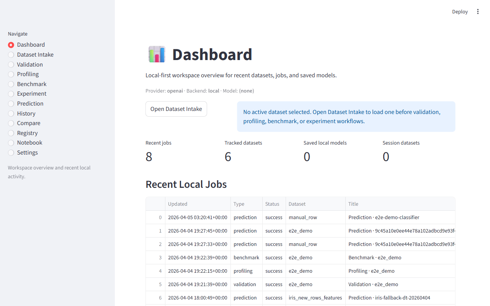<br><strong>Dashboard</strong> — Workflow progress and recent activity</td>
<td width="50%">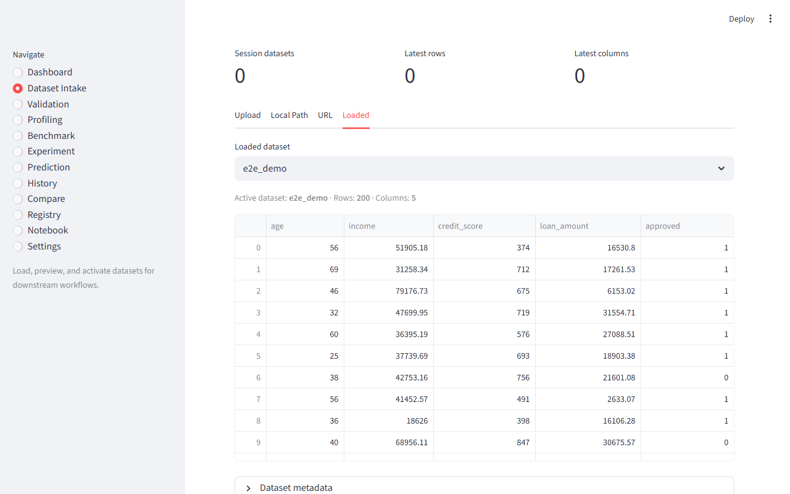<br><strong>Load Data</strong> — Files, URLs, or UCI repository</td>
</tr>
<tr>
<td width="50%">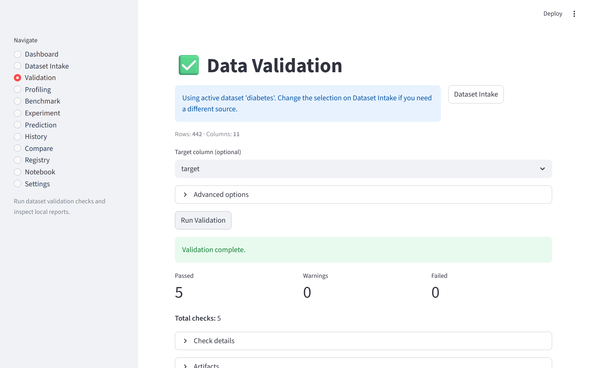<br><strong>Validation</strong> — Target-aware quality checks</td>
<td width="50%">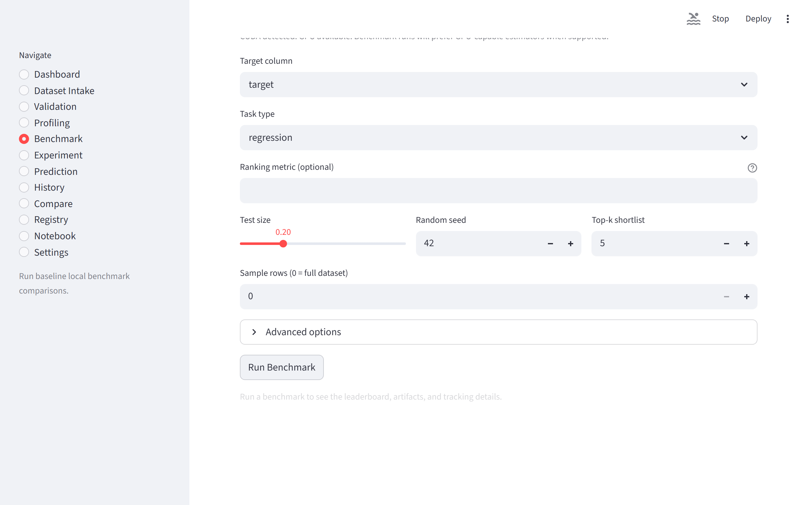<br><strong>Benchmark</strong> — Algorithm ranking leaderboard</td>
</tr>
<tr>
<td width="50%">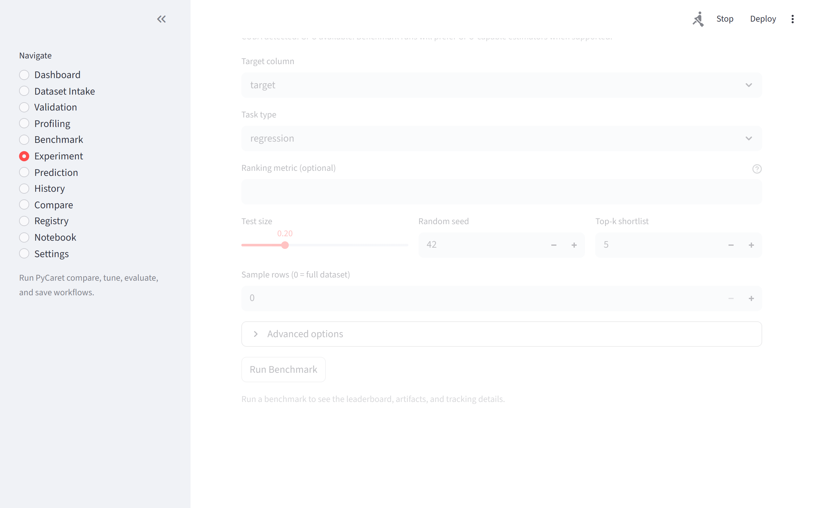<br><strong>Train & Tune</strong> — PyCaret experiment pipeline</td>
<td width="50%">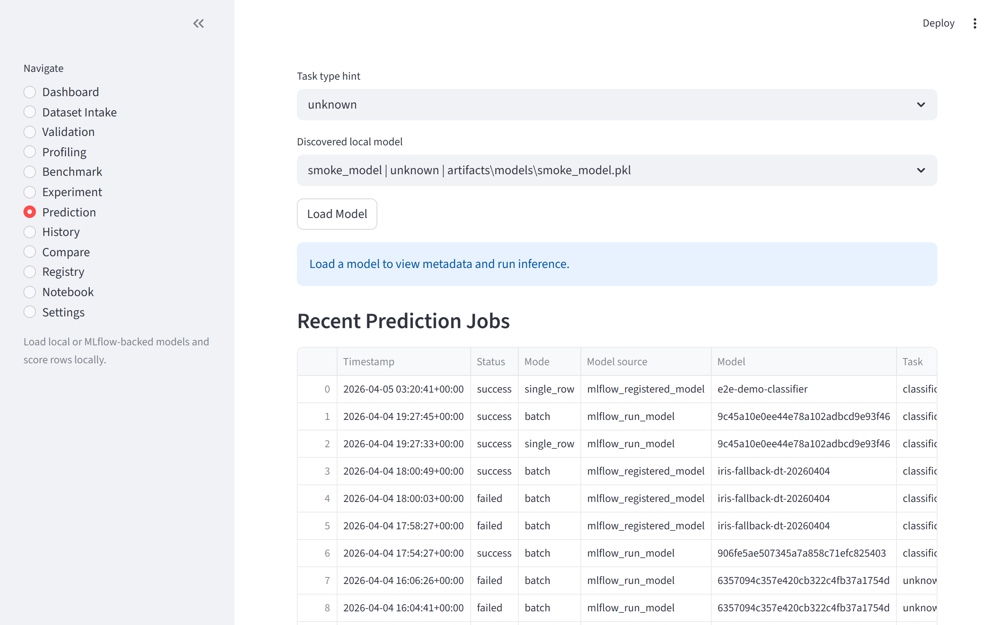<br><strong>Predictions</strong> — Batch and single-row scoring</td>
</tr>
<tr>
<td width="50%">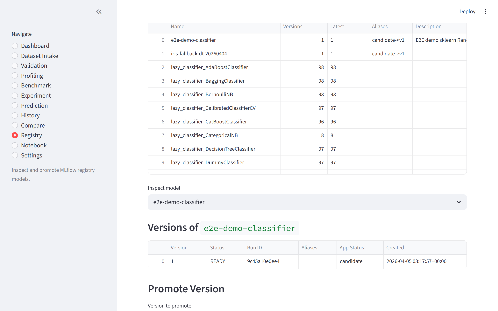<br><strong>Registry</strong> — Model versioning and promotion</td>
<td width="50%">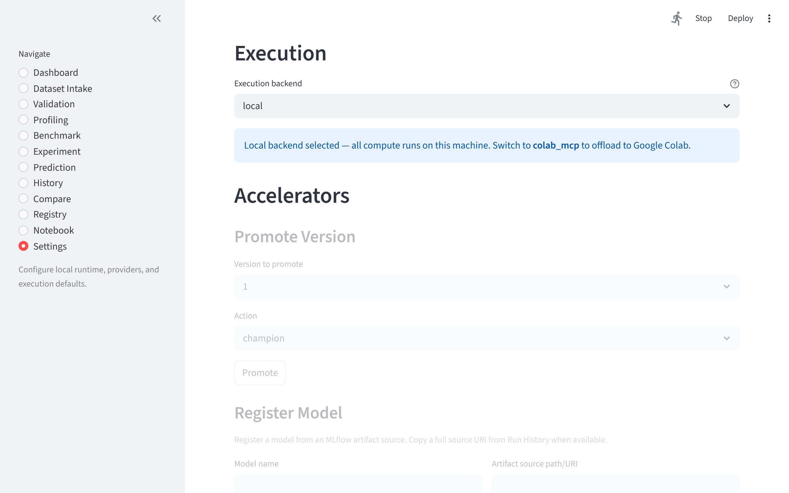<br><strong>Settings</strong> — Workspace and provider configuration</td>
</tr>
</table>

<details>
<summary>More screenshots</summary>

| | |
|---|---|
| 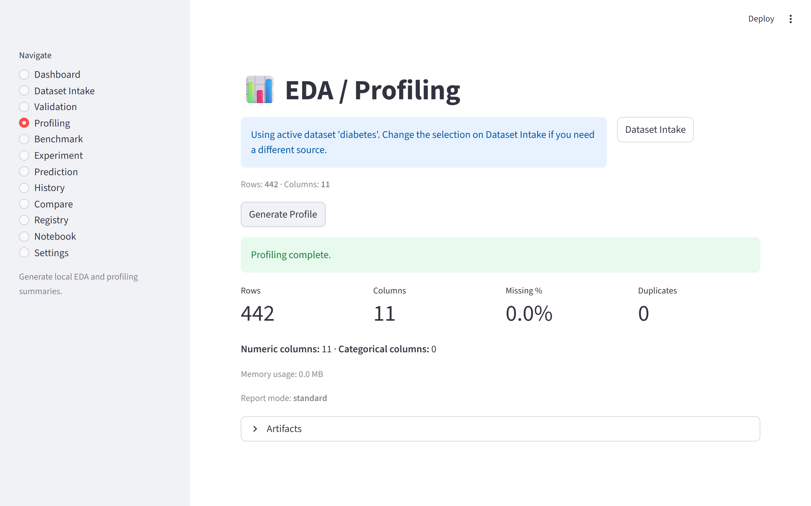 **Profiling** | 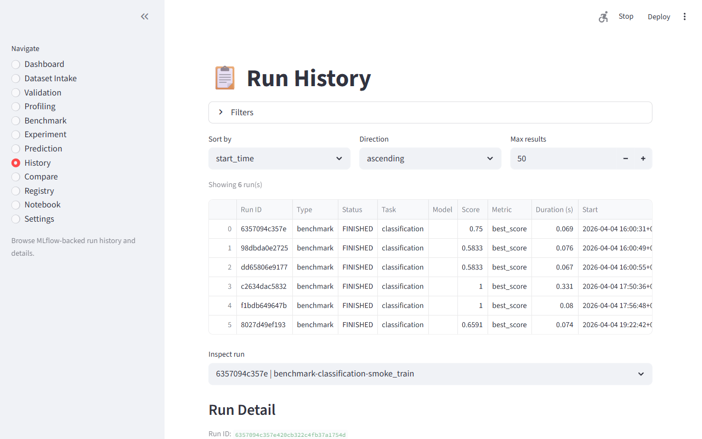 **History** |
| 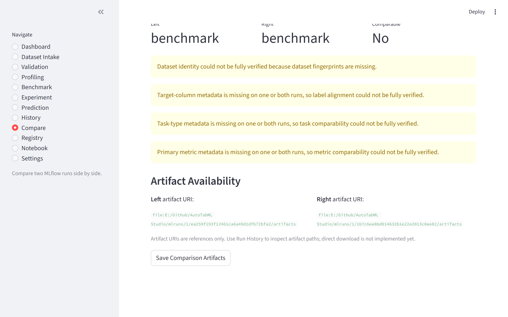 **Compare** | |

</details>

---

## 🏗️ Architecture

[Open the interactive architecture map](docs/autotabml-studio-architecture.html) to explore guided views, trace relationships, search components, and export the diagram.

```
┌─────────────────────────────────────────────────────┐
│                   Streamlit UI                      │
│  Dashboard · Load · Validate · Profile · Benchmark  │
│  Train & Tune · FLAML · Foundation Models · Predict │
│  Compare · Notebook · Registry · Settings           │
├─────────────────────────────────────────────────────┤
│                   CLI (argparse)                    │
├──────────────┬──────────────┬───────────────────────┤
│  Ingestion   │  Validation  │     Profiling         │
├──────────────┼──────────────┼───────────────────────┤
│ LazyPredict │ PyCaret │ FLAML │ TabFM │ TimesFM 2.5 │
├──────────────┴──────────────┴───────────────────────┤
│  Prediction · Tracking · Registry · Observability   │
│  Storage                                             │
├─────────────────────────────────────────────────────┤
│  MLflow (SQLite) · SQLite Metadata · artifacts/     │
└─────────────────────────────────────────────────────┘
```

Streamlit pages are **thin entry points**. All business logic lives in the service layer.
Services with one runtime implementation stay concrete; shared base classes are reserved for real multi-implementation or published extension boundaries.

<details>
<summary>Module map</summary>

| Module | Responsibility |
| --- | --- |
| `app/ingestion/` | Source routing, loaders, normalization, metadata hashing |
| `app/validation/` | Quality rules, optional Great Expectations checks |
| `app/profiling/` | Profiling orchestration, selectors, summaries |
| `app/modeling/benchmark/` | LazyPredict orchestration, ranking, MLflow logging |
| `app/modeling/pycaret/` | PyCaret compare, tune, evaluate, finalize, save |
| `app/modeling/flaml/` | Microsoft FLAML AutoML service, artifacts, tracking |
| `app/modeling/foundation/` | Pinned TabFM/TimesFM adapters, consent gates, artifacts, context persistence, MLflow summaries |
| `app/prediction/` | Model discovery, loading, schema checks, scoring |
| `app/tracking/` | MLflow queries, history, run comparison |
| `app/registry/` | MLflow model registration and promotion |
| `app/observability/` | Structured logging, correlation context, metrics hooks, optional tracing |
| `app/storage/` | SQLite metadata store |
| `app/providers/` | LLM integrations plus reference token pricing and cost estimates |
| `app/notebooks/` | Jupyter notebook generation |
| `app/config/` | Pydantic settings, enums, environment binding |
| `app/pages/` | Streamlit page entry points |
| `app/cli.py` | CLI entry point |

</details>

### Tech Stack

| Layer | Technology |
| --- | --- |
| **UI** | Streamlit |
| **CLI** | argparse |
| **Data** | pandas, Pydantic, pydantic-settings |
| **Benchmarking** | LazyPredict, scikit-learn, XGBoost, LightGBM, CatBoost |
| **Training / forecasting** | PyCaret, Microsoft FLAML, Google TabFM, Google TimesFM 2.5 |
| **Tracking** | MLflow (local SQLite backend) |
| **Observability** | JSON logging, metrics hooks, optional OpenTelemetry tracing |
| **Metadata** | SQLite |
| **AI Summaries** | OpenAI · Anthropic · Gemini · Ollama |
| **Testing** | pytest (729 tests), pytest-cov, pytest-asyncio, respx |

---

## 💻 CLI

```bash
autotabml auto-run data/train.csv --target target --mode auto --time-budget 120
autotabml job-list
autotabml job-status <job-id>
autotabml job-cancel <job-id>
autotabml drift-check data/new.csv --baseline artifacts/models/model_drift_baseline.json
autotabml deploy-export --model artifacts/models/model.pkl --metadata artifacts/models/model.json --output deploy/model
```

Examples below assume the synced `.venv` is active. If you are not activating it, prefix commands with `uv run`.

```bash
autotabml --version
autotabml info
autotabml doctor
```

```bash
# Data preparation
autotabml validate data/train.csv --target price --artifacts-dir artifacts/validation
autotabml profile data/train.csv --artifacts-dir artifacts/profiling

# Modeling
autotabml benchmark data/train.csv --target target --task-type auto
autotabml experiment-run data/train.csv --target target --task-type classification --n-select 3
autotabml flaml-run data/train.csv --target target --task-type auto --time-budget 120
autotabml flaml-save data/train.csv --target target --save-name best_model
autotabml tabfm-run data/train.csv --target target --accept-tabfm-license --allow-download
autotabml timesfm-forecast data/demand.csv --timestamp date --target demand --horizon 12 --allow-download

# Operations
autotabml predict-history --limit 10
autotabml history-list --run-type experiment --limit 10
autotabml registry-list
```

---

## ⚙️ Configuration

Settings are resolved in order: **Pydantic defaults → persisted `settings.json` → environment variables**.

```bash
# Core settings (AUTOTABML_ prefix)
AUTOTABML_WORKSPACE_MODE=dashboard
AUTOTABML_EXECUTION__BACKEND=local
AUTOTABML_MLFLOW__TRACKING_URI=sqlite:///artifacts/mlflow/mlflow.db

# LLM provider keys (no prefix)
OPENAI_API_KEY=sk-...
ANTHROPIC_API_KEY=sk-ant-...
GEMINI_API_KEY=...
```

See [.env.example](.env.example) for the full list.

---

## 📈 Observability

Runtime observability is **local-first**. Nothing is exported anywhere unless you explicitly wire an exporter.

- Set `AUTOTABML_LOG_FORMAT=json` to emit one JSON document per log line to stderr. The default remains `text` for local development.
- Training and prediction workflows automatically attach correlation fields such as `correlation_id`, `run_id`, `experiment_name`, `run_name`, and `task_type` when those values are available.
- Metrics hooks live behind `app.observability`, so you can swap the default in-process backend for Prometheus, StatsD, or OTLP adapters at startup without changing workflow code.
- Tracing is a no-op by default and upgrades automatically when `opentelemetry-api` is installed and configured.

```bash
# Structured JSON logs
AUTOTABML_LOG_FORMAT=json
AUTOTABML_LOG_LEVEL=INFO
uv run streamlit run app/main.py
```

---

## 🧪 Testing & CI

```bash
uv run pytest                              # Unit tests
uv run pytest -m integration               # Integration suite
uv run pytest --cov=app --cov-fail-under=65  # Coverage gate
```

| Workflow | Purpose |
| --- | --- |
| [CI](.github/workflows/ci.yml) | Lint (ruff) · Unit tests (Python 3.11 + 3.13) · Coverage ≥ 65% · E2E smoke |
| [Security](.github/workflows/security.yml) | `detect-secrets` + `gitleaks` on every push and PR |
| [Release](.github/workflows/release-readiness.yml) | Build validation + `twine check` for tagged releases |

CI uses the committed `uv.lock` for deterministic installs before linting, testing, coverage, and release validation.

Dependabot is configured for weekly dependency updates.

---

## ⚠️ Known Limitations

| Constraint | Detail |
| --- | --- |
| PyCaret requires Python < 3.13 | All other features work on 3.10 – 3.13 |
| TabFM weights | Separate `tabfm-non-commercial-v1.0` license; non-commercial, non-production research only; Python 3.11+ |
| First model use | TabFM and TimesFM require explicit approval before downloading their pinned Hugging Face snapshots |
| GPU training | Requires NVIDIA + CUDA; falls back to CPU automatically |
| Large datasets | 100K+ rows trigger automatic sampling |
| Kaggle | CLI-only; not exposed in the UI |
| Single-user | Designed for individual local use |
| Background concurrency | One training job runs at a time |
| Drift meaning | Input-distribution drift only; not target/concept drift |
| AI summaries | Require an API key or local Ollama |

---

## ✅ Verified Output (current `main`)

The numbers below come from running the project's own test, lint, and
verification scripts on a fresh `.venv` with Python 3.12.10:

| Check | Command | Result |
| --- | --- | --- |
| Lockfile consistency | `uv lock --check` | passes |
| Unit tests | `pytest tests/ -q` | **729 passed**, 30 deselected |
| Coverage gate | `pytest --cov=app --cov-fail-under=65` | CI gate ≥ 65% |
| Lint | `ruff check app/ tests/ scripts/` | **All checks passed** |
| Release metadata | `python -m app.release_metadata` | passes |

These commands are the same ones the CI and Security workflows run on every
push, so a passing local run is a faithful predictor of a green PR.

---

## 📚 Documentation

| Resource | Description |
| --- | --- |
| [USAGE.md](USAGE.md) | Complete usage guide with step-by-step instructions |
| [Interactive Architecture](docs/autotabml-studio-architecture.html) | Explorable system map with guided views and source evidence |
| [Developer Guide](docs/developer-guide.md) | Implementation notes and development workflow |
| [Contributing](CONTRIBUTING.md) | Contribution guidelines |
| [Release Notes v0.4.0](RELEASE_NOTES_v0.4.0.md) | Current release highlights and upgrade steps |

---

## 📄 License

AutoTabML Studio is Apache License 2.0 — see [LICENSE](LICENSE). Google TabFM
pretrained weights retain their separate `tabfm-non-commercial-v1.0` license;
the app requires explicit acceptance and blocks their saved contexts from
registry/deployment export.
