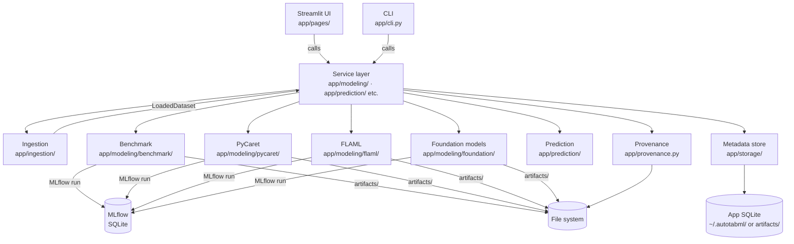

# Architecture

## Overview

AutoTabML Studio is a local-first AutoML workbench. All persistent state lives on the user's machine: an SQLite metadata database, an MLflow local-SQLite tracking store, and a file-system artifact tree under `artifacts/`. No outbound telemetry is sent unless the user explicitly supplies an LLM provider API key or triggers a Hugging Face model download.

Two entry points share a single service layer:

- `app/main.py` — Streamlit UI (20 pages under `app/pages/`)
- `app/cli.py` — 32 argparse sub-commands, entrypoint `autotabml` (defined in `pyproject.toml`)

## Data flow



## Module responsibilities

| Module | Responsible for | Must not |
|---|---|---|
| `app/ingestion/` | Source routing, loading (CSV, Excel, URL, Kaggle, UCI, HTML), normalization, metadata hashing | Parse business logic; touch ML engines |
| `app/validation/` | Quality rules, optional Great Expectations integration | Train models |
| `app/profiling/` | ydata-profiling orchestration, summaries | Validate data quality |
| `app/modeling/benchmark/` | LazyPredict sweep, ranking, MLflow logging | Persist final models (see `app/modeling/pycaret/`) |
| `app/modeling/pycaret/` | PyCaret compare → tune → evaluate → finalize → save pipeline | Run LazyPredict |
| `app/modeling/flaml/` | FLAML AutoML service, time-budget search, artifact persistence | Access PyCaret APIs |
| `app/modeling/foundation/` | TabFM and TimesFM adapters; license consent gates; revision-pinned checkpoint downloads | Allow TabFM-derived contexts to reach the registry or deployment export |
| `app/prediction/` | Model discovery, secure loading, schema validation, single-row and batch scoring | Re-train models |
| `app/tracking/` | MLflow history queries, run comparison | Write MLflow runs (done by each modeling module) |
| `app/registry/` | MLflow model registration and stage promotion (Champion / Candidate / Archived) | Run inference |
| `app/observability/` | Structured JSON logging, correlation context, metrics hooks, optional OpenTelemetry tracing | Block callers on failure (telemetry errors are swallowed) |
| `app/storage/` | SQLite metadata store — jobs, datasets, projects, batch runs, saved models | Perform ML computation |
| `app/providers/` | LLM provider clients (OpenAI, Anthropic, Gemini, Ollama) and pricing catalog | Store credentials; they live in environment variables only |
| `app/security/` | Secret masking, SSRF-resistant HTTP, formula-injection-safe CSV export, checksum-verified model loading | Perform business logic |
| `app/config/` | Pydantic settings (`AppSettings`), enums, environment binding | Write to disk (that is `app/config/settings.py`'s job) |
| `app/autorun.py` | Guided end-to-end AutoML job orchestration | Run interactively |
| `app/deployment.py` | Export a deployment bundle (model + metadata + provenance + FastAPI server stub) | Run inference |
| `app/drift.py` | Input-distribution drift detection against a saved baseline | Detect concept drift |
| `app/explainability.py` | SHAP model explanation artifacts | Train or score |
| `app/notebooks/` | Jupyter notebook generation from run artifacts | Execute notebooks |
| `app/backends/` | Execution backend abstraction (local vs. Colab MCP) | Contain ML logic |

## Main types and where they live

| Type | File | Notes |
|---|---|---|
| `AppSettings` | `app/config/models.py` | Pydantic root settings; resolved at `app/config/settings.py:load_settings()` |
| `LoadedDataset` | `app/ingestion/schemas.py` | Carries a pandas DataFrame + `DatasetMetadata`; produced by `app/ingestion/factory.py` |
| `DatasetMetadata` | `app/ingestion/metadata.py` | Content hash, schema hash, source locator, row/column counts |
| `JobRecord` | `app/storage/models.py` | Background job state persisted to SQLite |
| `ProvenanceManifest` | `app/provenance.py` | Reproducibility record written alongside every saved model |
| `BenchmarkConfig` / `BenchmarkResult` | `app/modeling/benchmark/schemas.py` | LazyPredict run configuration and output |
| `FlamlConfig` | `app/modeling/flaml/schemas.py` | FLAML AutoML configuration |
| `ExperimentConfig` | `app/modeling/pycaret/schemas.py` | PyCaret pipeline configuration |
| `RepositoryContext` | `app/storage/repositories/base.py` | Shared connector + lazy-migration initializer passed to every repository |

## External systems

| System | How accessed | When used |
|---|---|---|
| MLflow (local SQLite) | `mlflow` Python SDK; URI configured in `AppSettings.tracking.tracking_uri` | Every modeling workflow logs runs here |
| App metadata SQLite | `app/storage/sqlite_connector.py` | Always; stores jobs, datasets, projects, batch runs |
| Hugging Face Hub | `huggingface_hub.snapshot_download` (revision-pinned) | On first TabFM or TimesFM use, after explicit user opt-in |
| LLM providers | `httpx` via `app/providers/` (SSRF-safe) | AI summary features only; require API key |
| Kaggle API | `kaggle` SDK | `kaggle`-extra only; CLI interface only |
| UCI ML Repository | `ucimlrepo` | `uci`-extra; available in both UI and CLI |
| FastAPI / Uvicorn | `serve`-extra | Deployment bundle export only |

## Settings resolution order

```
Pydantic defaults
  → ~/.autotabml/settings.json   (written by the Streamlit Settings page)
  → Environment variables         (AUTOTABML_ prefix, __ nested delimiter)
```

API keys are never written to `settings.json`; they travel in environment variables and Streamlit session state only.

## Artifact directory layout (default)

```
artifacts/
  benchmarks/       LazyPredict CSV/JSON results
  experiments/      PyCaret and FLAML model artifacts, evaluation plots
    foundation/     TabFM and TimesFM outputs
  models/           Saved local models (checksum sidecars alongside .pkl)
  predictions/      Scored CSV outputs
  validation/       Validation JSON and markdown reports
  profiling/        ydata-profiling HTML and JSON
  mlflow/           MLflow SQLite DB and run artifact store
  jobs/             Background job state files
```

See also: `docs/architecture.md` (interactive component map), `docs/developer-guide.md` (local setup).
